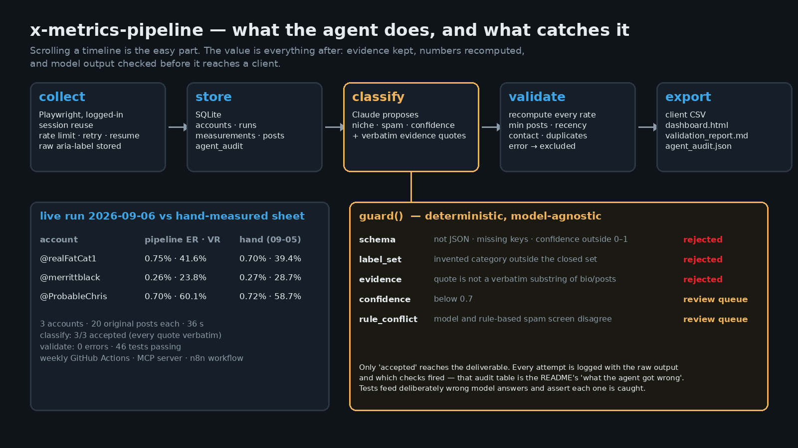
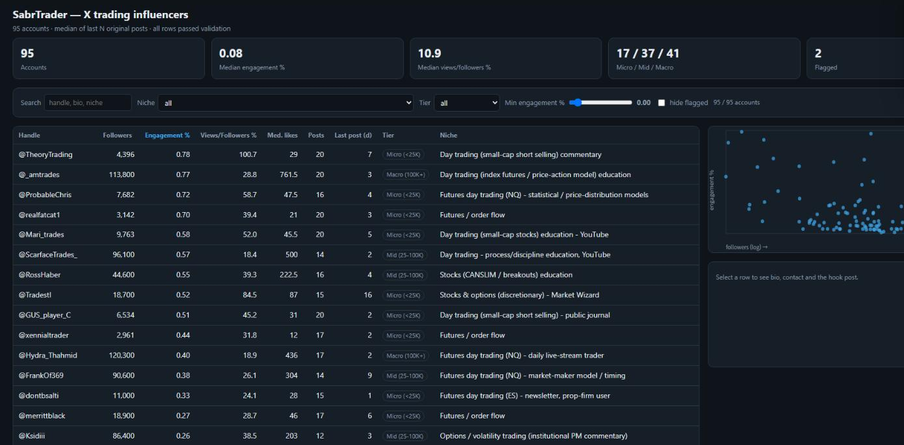
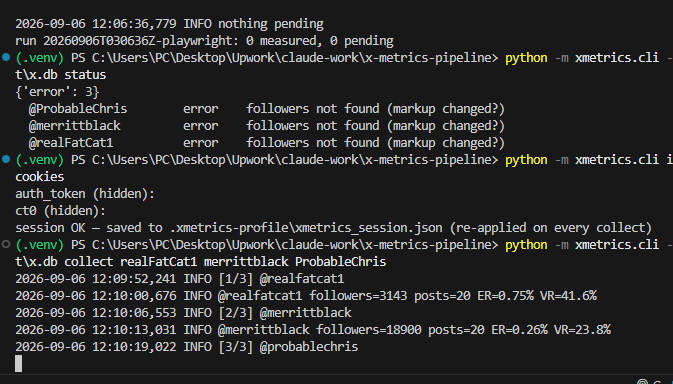
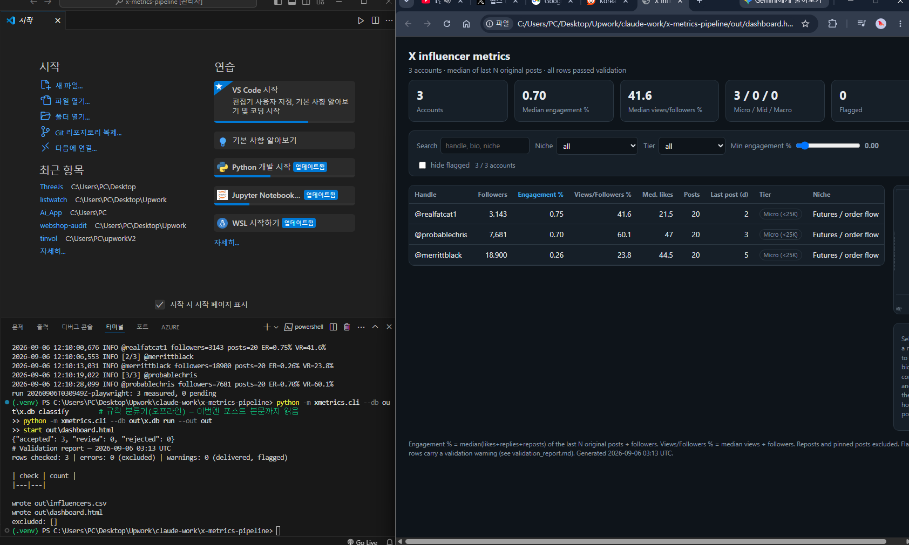

# x-metrics-pipeline

Measure X (Twitter) accounts from a logged-in timeline, classify them with an LLM **behind deterministic guardrails**, validate every number, and ship a CSV + a single-file dashboard — on a schedule.

Built from a paid engagement (100 trading-niche accounts for a day-trading platform's outreach list, Sept 2026). The first 100 were measured by hand; this is the tool that makes that the last time.





## What it does

```
collect ──▶ store ──▶ classify ──▶ validate ──▶ export
Playwright   SQLite    Claude +     recompute    CSV
logged-in    4 tables  guardrails   + rules      dashboard.html
session      + audit   + review     + report     validation_report.md
                       queue                     agent_audit.json
```

| stage | what it guarantees |
|---|---|
| **collect** (`collect.py`) | Persistent browser profile (log in once, no password stored). Jittered rate limiting, exponential-backoff retries, backs off on X's rate-limit page. **Resumable**: pending accounts are read from the DB, so a crash loses nothing. Reposts and pinned posts are excluded from the sample. The exact `aria-label` string behind every count is stored next to the number. |
| **parse** (`parse.py`) | Formats captured live (`fixtures/aria_samples.json`). X omits zero-valued fields (`"13 likes, 1157 views"`), so absence is recorded as *absent*, never assumed. Markup change → `ParseError`, never a silent 0. |
| **metrics** (`metrics.py`) | Pure functions. Engagement % = median over the last N original posts of (likes+replies+reposts) ÷ followers. Views/followers %. Tier. Days since last post. Everything re-computable from stored posts. |
| **store** (`store.py`) | SQLite: `accounts`, `runs`, `measurements`, `posts`, `agent_audit`. Idempotent upserts; re-running a week overwrites, never duplicates. |
| **classify** (`agent.py`) | Claude proposes niche / spam / confidence / **verbatim evidence quotes**. Output goes through `guard()` — see below. Offline `RuleClassifier` keeps the pipeline runnable without a key. |
| **validate** (`validate.py`) | Recompute every rate from raw data and compare; min posts; recency; contact present; duplicate bio URLs; cross-check against an external sheet. `error` rows are excluded from the deliverable, `warn` rows are delivered flagged. |
| **export** (`export.py`) | Client CSV (same columns as the hand-made sheet) + `dashboard.html` (no dependencies, opens from disk: search, niche/tier filters, engagement slider, sortable table, followers-vs-engagement scatter, per-account detail). |
| **schedule** | `.github/workflows/weekly.yml` (validate is `--strict`: a failed check fails the job) and `n8n/x-metrics-weekly.json` for teams on n8n. Optional Slack summary. |
| **MCP** (`mcp_server.py`) | Read-only MCP server so Claude can query the dataset: `search_accounts`, `account`, `validation_summary`, `agent_audit`. |

## The guardrail — what the agent gets wrong, and what catches it

The model never writes to the deliverable. Every answer passes `guard()`:

| check | catches | verdict |
|---|---|---|
| `schema` | prose instead of JSON, missing keys, wrong types, confidence outside 0–1 | rejected |
| `label_set` | invented categories ("Quant futures educator") — labels must come from a closed set | rejected |
| `evidence` | **hallucinated justification**: every evidence quote must be a verbatim substring of the bio/posts the model was shown | rejected |
| `confidence` | below threshold (0.7) | review queue (a human decides) |
| `rule_conflict` | model and the rule-based spam screen disagree | review queue |

Every attempt is logged to `agent_audit` with the raw output and which checks fired. `out/agent_audit.json` from the current dataset (95 accounts, offline rule classifier, bio-only input):

```json
{"attempts": 95, "by_verdict": {"accepted": 23, "review": 32, "rejected": 40},
 "guardrail_fired": {"evidence": 40, "confidence": 72}}
```

Read: with only a bio to go on, the classifier could ground a label for 23 accounts; 72 answers were too uncertain for a client sheet and 40 could not cite evidence at all — so they never reached the client. Feed it post texts (the collector stores them) and the accepted share rises; the guardrail stays the same.

`tests/test_agent_guardrails.py` feeds deliberately wrong model outputs (invented category, plausible-but-fabricated quote, paraphrased quote, low confidence, fence-wrapped JSON, prose) and asserts each is caught without the model's cooperation.

## Live run (2026-09-06, Windows, logged-in session) — evidence in `docs/live-run-2026-09-06/`

| | |
|---|---|
|  |  |
| collector's own browser, logged-in timeline being read | 3 accounts in 36 s, 20 original posts each |



Files in that folder are the untouched outputs of that run: `terminal.log`, `influencers.csv`, `dashboard.html`,
`validation_report.md`, `agent_audit.json`. Against the sheet measured by hand the day before:

| account | pipeline | hand (09-05) |
|---|---|---|
| @realFatCat1 | 3,143 · ER 0.75% · VR 41.6% | 3,142 · 0.70% · 39.4% |
| @merrittblack | 18,900 · 0.26% · 23.8% | 18,900 · 0.27% · 28.7% |
| @ProbableChris | 7,681 · 0.70% · 60.1% | 7,682 · 0.72% · 58.7% |

Differences are one day of new posts shifting the 20-post window, plus the per-post-median definition (Design notes).
Classification with bio + 20 post texts: 3/3 accepted (every evidence quote verbatim). Validation: 0 errors.


The GIF is that run, recorded by the collector itself (`collect --record docs/recording …` → `python tools/webm_to_gif.py docs/recording`).

## Proof on real data

`fixtures/` holds the hand-measured deliverable (JSONL of medians for 148 accounts, 53 screened out with reasons, and the CSV the client received).

```
$ python -m pytest -q
46 passed
$ python -m xmetrics.cli --db out/x.db import-legacy fixtures/legacy_m2_results.jsonl
imported: 95 accounts (53 screened out)
$ python -m xmetrics.cli --db out/x.db validate --csv fixtures/legacy_master.csv
rows checked: 95 | errors: 0 | warnings: 7
```

Every followers count, engagement rate, views ratio and post count in the delivered CSV matches the recomputation (tolerance = the sheet's rounding). The 7 warnings: 5 rows measured before the JSONL existed, 2 accounts sharing one bio URL (same firm, both legitimate).

## Run it

```bash
pip install -e .[dev]
python -m playwright install chromium

# 1. one-time session — either log in in the collector's own browser window…
python -m xmetrics.cli login --profile .xmetrics-profile
#    …or reuse a session from a browser you are already logged in to (DevTools > Application > Cookies > x.com)
python -m xmetrics.cli import-cookies --profile .xmetrics-profile

# 2. measure
python -m xmetrics.cli --db out/x.db collect --profile .xmetrics-profile realFatCat1 merrittblack ...
#    Ctrl-C any time; re-run the same command to resume.

# 3. classify (Claude if ANTHROPIC_API_KEY is set, else the offline rule classifier)
python -m xmetrics.cli --db out/x.db classify --claude

# 4. validate + export
python -m xmetrics.cli --db out/x.db run --out out --strict
# -> out/influencers.csv  out/dashboard.html  out/validation_report.md  out/agent_audit.json
```

## Design notes

- **Measure, don't estimate.** Nothing here calls a third-party "influencer score" API. Numbers come from the timeline a person would see, and the raw strings are kept.
- **Sum of medians vs median of sums.** The hand-made sheet used Σmedian(likes, replies, reposts)/followers. The pipeline computes median(likes+replies+reposts) per post — the statistically honest one. Legacy rows keep their definition so validation compares like with like; the difference is documented in `metrics.py`.
- **Fail loudly.** Markup drift raises; validation errors exclude rows and (with `--strict`) fail CI. A tool that quietly gives wrong numbers is worse than no tool.
- **Boring things done right.** Retries with backoff, jittered rate limiting, idempotent writes, resumable runs, audit table, evidence stored beside every number.

## Layout

```
xmetrics/   parse · metrics · store · legacy · validate · agent · export · collect · cli
tests/      46 tests (parser formats, metrics, legacy cross-check, guardrails)
fixtures/   captured aria-labels + the real 2026-09 deliverable
out/        generated: CSV, dashboard, validation report, agent audit
mcp_server.py  ·  n8n/  ·  .github/workflows/weekly.yml
```
